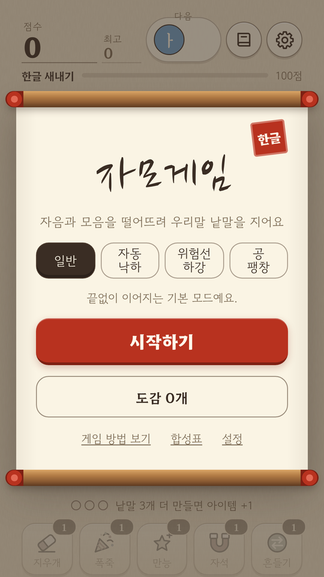
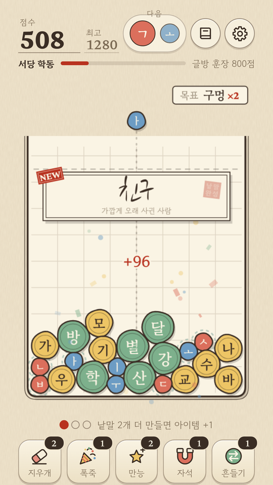
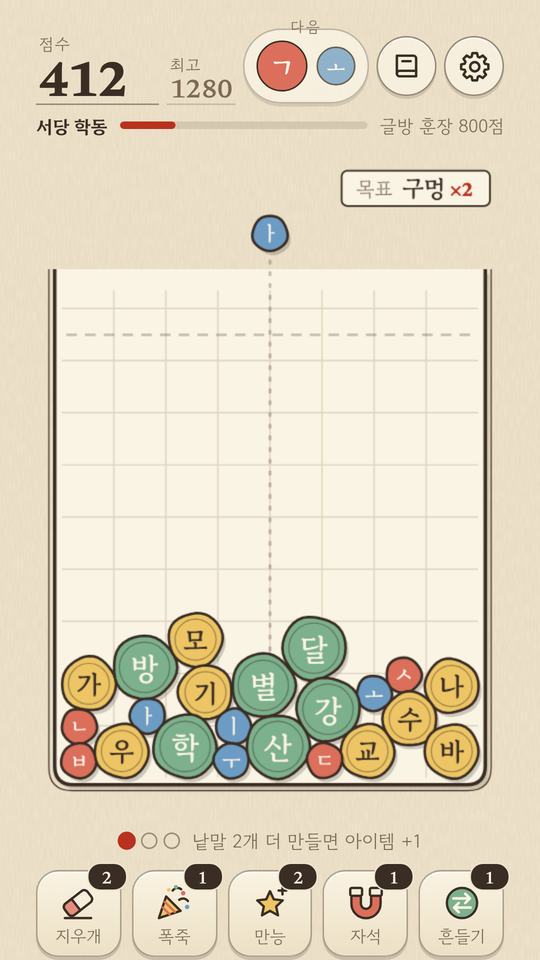
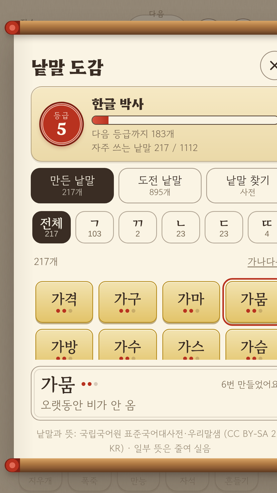

# 자모게임

자음과 모음을 떨어뜨려 글자를 만들고, 두 글자가 우리말 낱말이 되면 터지는 **한글 물리 퍼즐 게임**이에요.
ㄱ + ㅏ = 가, 가 + ㅂ = 갑 … 한글이 만들어지는 원리를 직접 해 보면서 낱말을 모아요.

<p align="center">
  
  
  
  
</p>

**▶ 플레이: https://jangabc3.github.io/jamo-game/** (폰 브라우저에서 열고 "홈 화면에 추가"하면 앱처럼 써요)

## 특징
- 한글 조합 규칙(초성·중성·종성, 겹모음, 겹받침)을 직접 구현했어요
- 표준국어대사전·우리말샘의 두 글자 낱말 약 6만 개 지원, 일부는 뜻풀이 포함
- 낱말 도감: 등급, 초성별 칸, 숙련도, 도전 낱말(뜻 보고 맞히기)
- 급수·연쇄·콤보 점수, 아이템, 위험 구간 연출, 점수 공유 이미지
- 인터넷 없이 실행되는 PWA(글꼴·엔진·사전 모두 포함), 광고 없음
- 한지와 붓글씨 느낌의 화면, Web Audio로 직접 합성한 효과음과 배경음

## 기술
| 영역 | 사용한 것 |
| --- | --- |
| 언어 | JavaScript(프레임워크 없음), HTML5, CSS3 |
| 화면 | Canvas 2D(공), HTML·CSS(나머지 화면) |
| 물리 | Matter.js 0.19 |
| 소리 | Web Audio API |
| 저장 | localStorage |
| 앱화 | PWA(서비스 워커), 스토어용 포장은 Capacitor 설정 준비 중 |
| 도구 | Python(빌드, 뜻풀이 수집) |
| 배포 | GitHub Pages |

## 실행
```bash
python3 tools/build.py                    # docs/ (GitHub Pages용)와 dist/jamo.html(한 파일)을 만들어요
cd docs && python3 -m http.server 8000    # http://localhost:8000
```

## 폴더
| 위치 | 내용 |
| --- | --- |
| `src/js/00~03` | 환경, 한글 조합·분해, 사전 불러오기, 도감 저장 |
| `src/js/04~05` | 화면 크기·모드·상태, 합성 규칙 `rule(A, B)` |
| `src/js/06~08` | 물리 세계·충돌, 낱말 터짐·점수, 다음 공 뽑기와 난이도 곡선(`DIFF`) |
| `src/js/09`, `10` | 이펙트, 효과음·배경음 |
| `src/js/11~16` | 점수판, 입력, 설정, 도감, 모드, 합성표 화면 |
| `src/js/17~19` | 게임 시작·종료·급수, 튜토리얼, 공유 이미지 |
| `src/js/20~23` | 캔버스 그리기, 게임 루프, 광고 연결부(`22a-ads`, 현재 꺼짐), 시작 |
| `src/css/` | 기본 → 다듬기 → 움직임 → 도감 순서 |
| `data/dict.txt` | `낱말|뜻|등급` 형식의 사전 데이터 |
| `public/` | 글꼴(woff2), Matter.js, 아이콘, manifest, 개인정보처리방침 |
| `tools/` | `build.py`(빌드), `fetch_defs.py`(뜻풀이 수집) |
| `assets/` | README용 스크린샷 |
| `docs/` | 빌드 결과(GitHub Pages가 이 폴더를 서비스) |

스크립트는 번호 순서대로 불러오며, 같은 전역 범위를 공유해요.

## 더 보기
- 출처와 라이선스: [`NOTICE.md`](NOTICE.md) (사전 데이터는 CC BY-SA 2.0 KR)
- 스토어 출시 준비: [`PUBLISHING.md`](PUBLISHING.md)
- 개인정보처리방침: [privacy.html](https://jangabc3.github.io/jamo-game/privacy.html)
